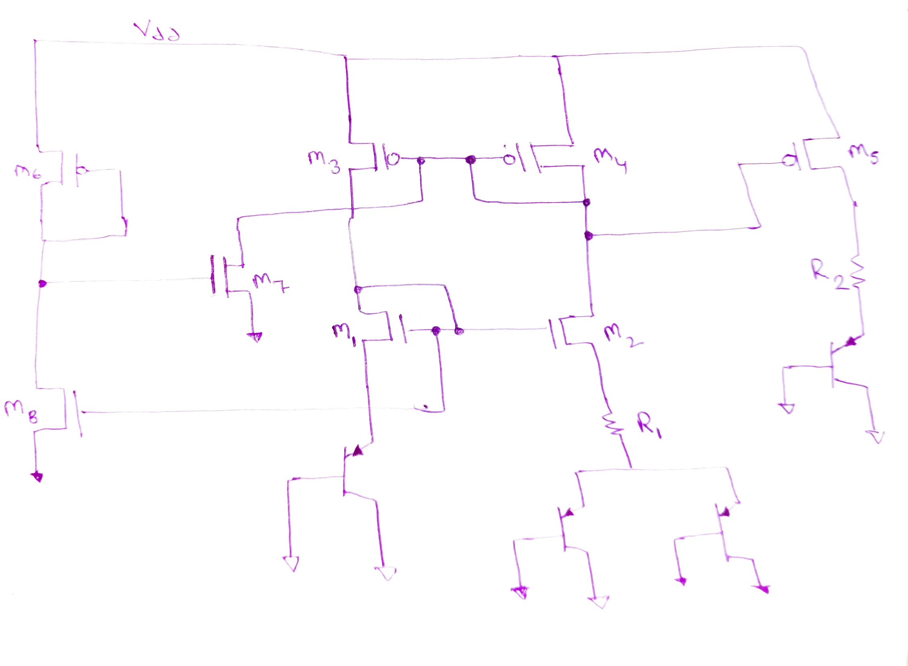
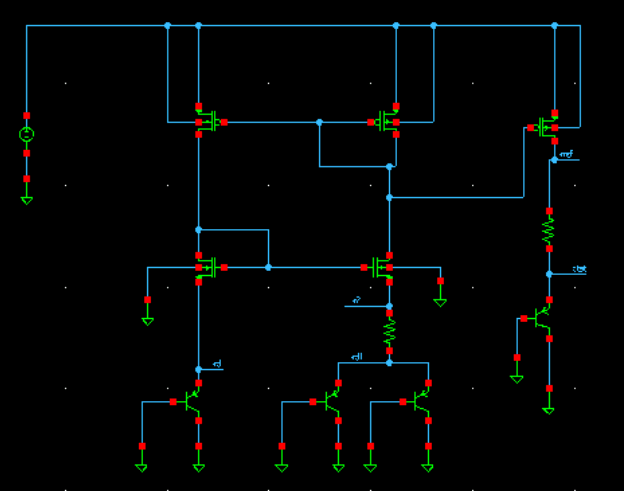
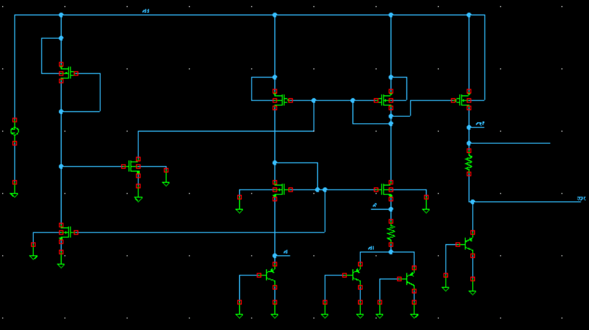
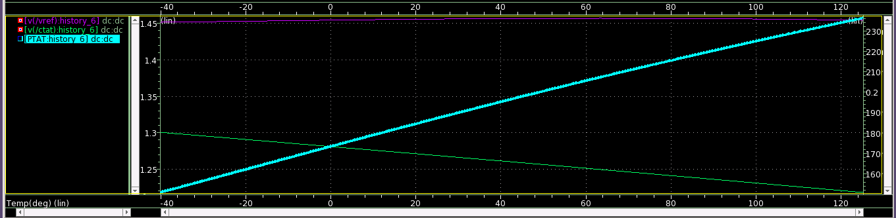
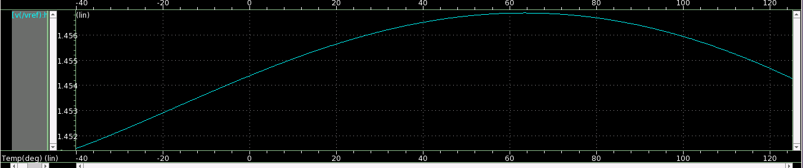
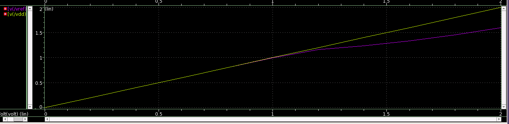
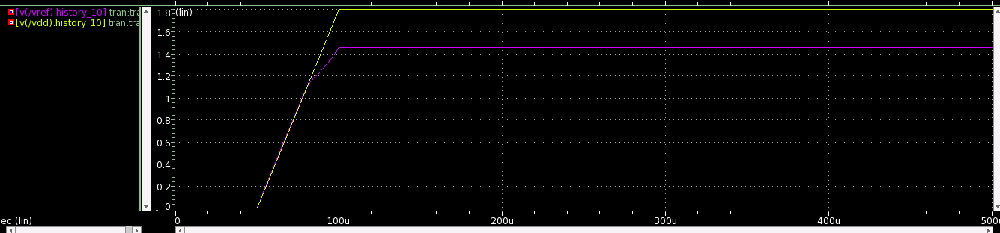

## Design-a-band-gap-refernce-with-start-up-circuit-using-current-mirror
Implementation of bandgap reference circuit on  Synopsys Custom Compiler Tool  on 28nm CMOS Technology .
  

  <h3 align="center">Bandgap Reference Design</h3>

<!-- TABLE OF CONTENTS -->

  
Table of Contents

  <ol>
    <li>
      <a href="#Introduction">Introduction</a>
    </li>
  <li>
      <a href="#Synopsys Custom Compiler Tool Detailss">Synopsys Custom Compiler Tool Details</a>
	  <ul>
        <li><a href="#Custom Compiler">Custom Compiler</a></li>
    </ul>
  </li>
	  <li>  
	  <li> 	  <a href="#Reference Circuit"> Reference Circuit </a>  </li>
          <li>    <a href="#Reference Circuit Diagram"> Reference Circuit Diagram </a></li
	  </li>  
	       <li>
      <a href="#schematic">Schematic</a>
	</li>
	<li>
      <a href="#pre-layout simulations">Pre-Layout Simulations</a>	
	  	<ul>
        <li><a href="#temperature variation check">Temperature Variation Check</a></li>
        <li><a href="#voltage variation check">Voltage Variation Check</a></li>
      </ul>
    </li>    
    <li><a href="#future work">Future Work</a></li>
	  <li><a href="#references">References</a></li>
	  <li><a href="#acknowledgement">Acknowledgement</a></li>
	
  </ol>

                                         
## Introduction
THE BANDGAP REFERENCE (BGR) is a critical building component in most analogue circuits such as regulators, oscillators, ADCs, and so on, because all 
Integrated Circuits (ICs) rely on a temperature-independent voltage reference.

## Synopsys Custom Compiler Tool Details
The [Synopsys Custom Compiler™](https://www.synopsys.com/implementation-and-signoff/custom-design-platform/custom-compiler.html) design environment is a modern solution for full-custom analog, custom digital, and mixed-signal IC design. As the heart of the Synopsys Custom Design Platform, Custom Compiler provides design entry, simulation management and analysis, and custom layout editing features. It delivers industry-leading productivity, performance, and ease-of-use while remaining easy to adopt for users of legacy tools.

 
  Fig 1 : Synopsis Custom Compiler 

## Reference Circuit Details
An output voltage with low sensitivity is achieved in bandgap reference as the sum of a voltage that is Proportional To Absolute Temperature (PTAT) and a voltage with a negative temperature coefficient that is Complementary To Absolute Temperature (CTAT) (CTAT). The PTAT voltage is calculated by subtracting the base-emitter voltages of two bipolar transistors. The voltage across a forward biassed p-n junction or the base-emitter voltage (VBE) of a diode coupled bipolar junction transistor (BJT) is commonly used to calculate the CTAT voltage. The BJT transistors have been used to create voltage reference circuits, where the I-V properties of the BJTs provide an appealing approach of overcoming PVT changes.

## Reference Circuit Diagram   

 
  Fig. 2: Refernce Circuit 

# Simulation in Synopsys
## Schematic

 
  Fig. 2: Band Gap Refernce Circuit 

 
  Fig.3: Band Gap Refernce Circuit  with start-up circuit

## Pre-layout Simulation
  <li><a href="#temperature variation check">Temperature Variation Check</a></li>
  

   
  Fig.4 temperaure sweep:  
 

  </li>
  <li><a href="#temperature variation check">Refernce Voltage Check</a></li>
  

   
  Fig.4 temperaure sweep:  
   

   </li>
  
  <li><a href="#voltage variation check">Voltage Variation Check</a></li>
      

       
       Fig. 5 voltage sweep:  
      

      </ul>
    </li>  
     <li><a href="#voltage variation check">Voltage Variation Check</a></li>
      

       
       Fig. 5 voltage sweep:  
      

      </ul>
    </li>  
    
## Conclusion
 The repository presents the design and simulation of band gap refernce circuit using start-up on 28nm technology node.Add cascode transistors in the design to improve stability of output  reference voltage.
    

## Acknowledgement

1. Kunal Ghosh, Co-founder, VSD Corp. Pvt. Ltd. - kunalpghosh@gmail.com
2. Chinmay panda, IIT Hyderabad
3. Sameer Durgoji, NIT Karnataka
4. [Synopsys Team/Company](https://www.synopsys.com/)
5. [Cloud Based Analog IC Design Hackathon](https://www.iith.ac.in/events/2022/02/15/Cloud-Based-Analog-IC-Design-Hackathon/)
6. [Synopsys India](https://www.synopsys.com/)
7. [VLSI System Design (VSD) Corp. Pvt. Ltd India](https://www.vlsisystemdesign.com/)

## Reference
1. Zhanke Yan, Chunming Zhang, Menghai Wang, “LowVoltage Band-gap Reference Circuit in 28nm CMOS,” 2018 IEEE Asia Pacific Conference 
on Circuits and Systems.
2.Behzad Razavi. “Design of Analog CMOS Integrated Circuits,” Tata McGraw-Hill Edition, 2002, ch. 11, pp
